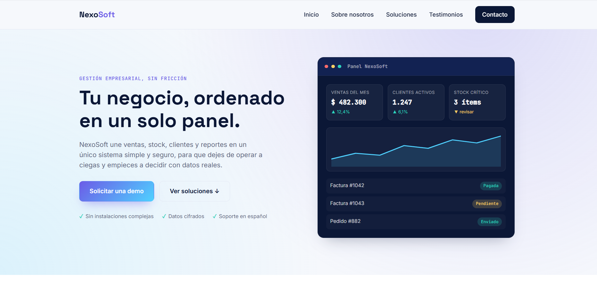
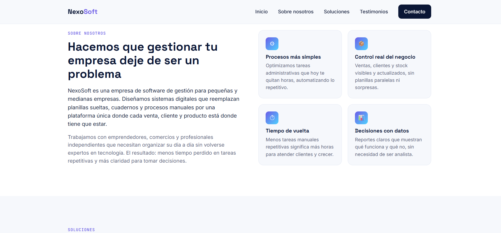
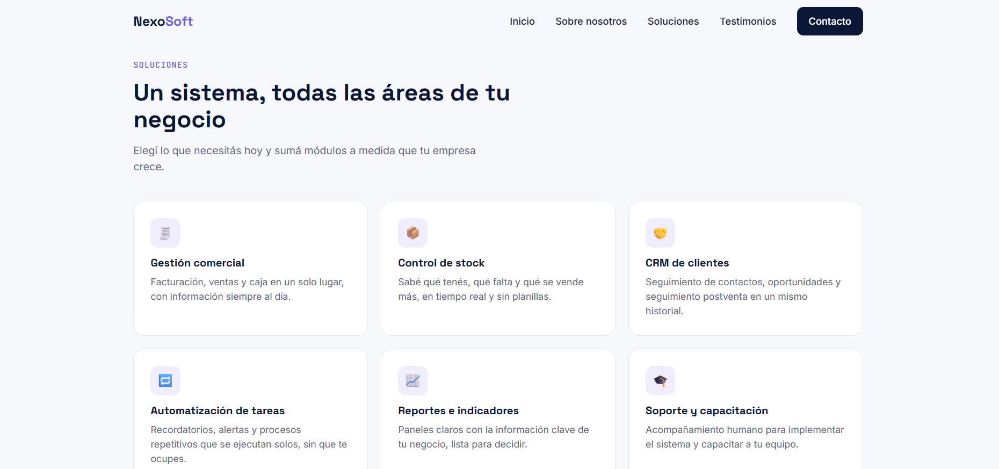
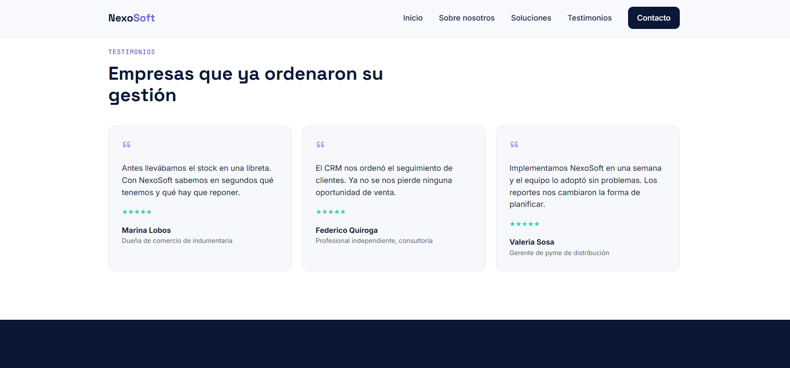
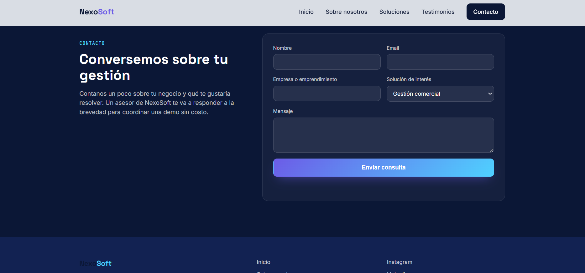
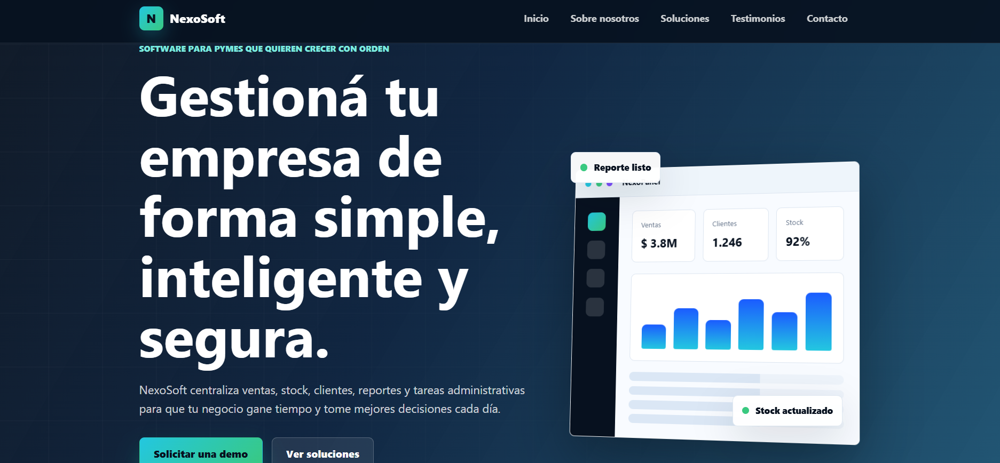
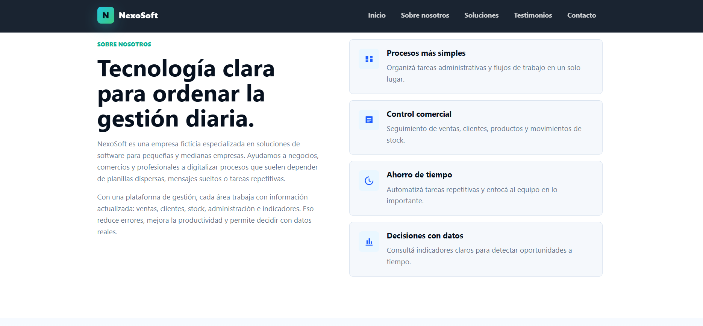
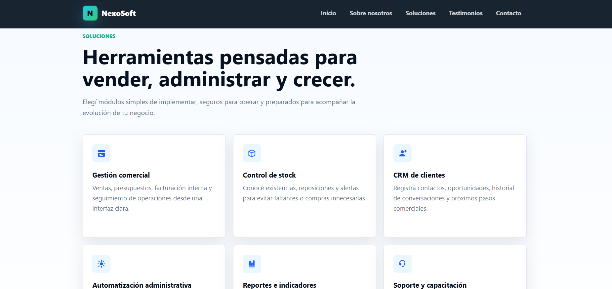
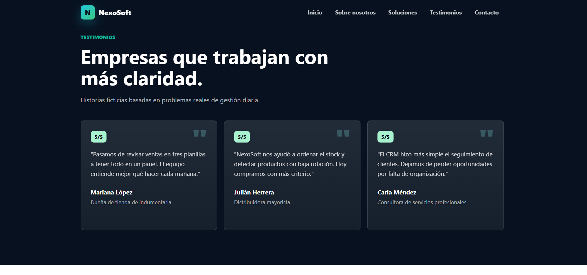
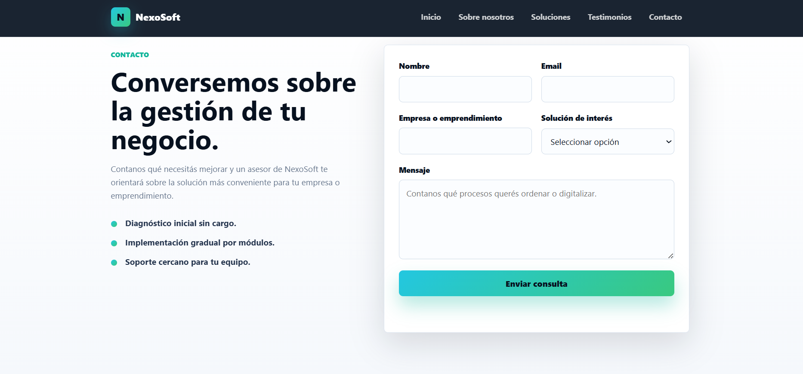

# PFO2 - Prompt Engineering en Agentes de IA

## Datos del estudiante

* **Estudiante:** Guillermina Zen Cáffaro
* **Comisión:** C
* **Trabajo:** Práctica Formativa Obligatoria 2
* **Tema:** Prompt Engineering en Agentes de IA
* **Proyecto:** Landing Page para empresa ficticia de venta de software

---

## Descripción del proyecto

Este proyecto fue desarrollado para la Práctica Formativa Obligatoria 2, cuyo objetivo es diseñar un único prompt inicial de alta precisión y utilizarlo en dos agentes de desarrollo de software distintos.

La consigna propone generar una Landing Page utilizando el mismo prompt en ambos agentes, sin modificar manualmente el código producido, para luego comparar los resultados obtenidos en cuanto a diseño, estructura, organización visual y capacidad de resolución autónoma.

La Landing Page generada corresponde a una empresa ficticia llamada **NexoSoft**, dedicada a la venta de soluciones de software para pequeñas y medianas empresas.

---

## Agentes utilizados

### Primer agente

* **Agente:** Claude
* **Modelo:** Sonnet 4.6

### Segundo agente

* **Agente:** Codex
* **Modelo:** GPT-5.5

---

## Link al deploy unificado

El proyecto fue desplegado en Vercel mediante un único enlace que dirige a la portada principal con tres accesos:

1. Texto plano del prompt utilizado.
2. Landing Page generada por Claude.
3. Landing Page generada por Codex.

**Link al deploy:**
PEGAR AQUÍ EL LINK DE VERCEL

---

## Estructura del proyecto

```text
PFO2-NexoSoft/
│
├── index.html
├── styles.css
├── prompt.txt
├── README.md
│
├── agente-1/
│   ├── index.html
│   ├── styles.css
│   └── script.js
│
├── agente-2/
│   ├── index.html
│   ├── styles.css
│   └── script.js
│
└── docs/
    └── capturas/
        ├── claude.png
        └── codex.png
```

---

## Prompt exacto utilizado

El siguiente prompt fue utilizado de forma idéntica en ambos agentes de desarrollo:

```text
Actúa como un agente senior de desarrollo frontend especializado en diseño web, accesibilidad, responsive design y buenas prácticas de HTML, CSS y JavaScript.

OBJETIVO

Generar una Landing Page completa, moderna, responsive y visualmente atractiva para una empresa ficticia de venta de software llamada “NexoSoft”.

La Landing Page debe estar desarrollada como un sitio web estático, utilizando HTML5, CSS3 y JavaScript vanilla si fuera necesario. No debe utilizar backend, base de datos ni frameworks pesados.

Este desarrollo forma parte de una práctica de Prompt Engineering en Agentes de IA. Debes resolver la consigna de manera autónoma a partir de este único prompt inicial.

TEMA DE LA LANDING PAGE

Marca: NexoSoft

Descripción:
NexoSoft es una empresa dedicada a la venta de soluciones de software para pequeñas y medianas empresas. Ofrece sistemas digitales para mejorar la gestión comercial, administrativa y operativa de negocios que buscan organizar sus procesos, ahorrar tiempo y tomar mejores decisiones.

Público objetivo:
Emprendedores, comercios, pymes, profesionales independientes y empresas que necesitan digitalizar su gestión diaria mediante herramientas simples, seguras y eficientes.

Tono de comunicación:
Claro, moderno, profesional, confiable y cercano. Todo el contenido debe estar escrito en español. No uses textos genéricos como “Lorem ipsum”.

REQUISITOS OBLIGATORIOS DE LA LANDING PAGE

La página debe incluir como mínimo las siguientes secciones:

1. HEADER

Crear una cabecera con:

- Logo textual: NexoSoft.
- Menú de navegación con enlaces internos a:
  - Inicio
  - Sobre nosotros
  - Soluciones
  - Testimonios
  - Contacto

El header debe verse correctamente en escritorio, tablet y celular.

2. HERO SECTION

Crear una sección principal de alto impacto visual que incluya:

- Un título principal atractivo relacionado con la venta de software.
- Un subtítulo que explique claramente la propuesta de valor.
- Un botón principal de llamada a la acción.
- Un botón secundario o enlace alternativo.
- Un elemento visual atractivo creado con HTML, CSS, SVG, formas, tarjetas, ilustración simple, mockup de software, panel de control o gradientes. No utilizar imágenes con copyright.

El botón principal debe llevar a la sección de contacto.

Idea orientativa para el mensaje principal:
“Software inteligente para gestionar tu empresa de manera simple”.

Podés mejorar el texto si considerás que aporta mayor impacto comercial.

3. SOBRE NOSOTROS

Incluir una sección que explique:

- Qué es NexoSoft.
- Qué problema ayuda a resolver.
- Por qué contar con un software de gestión puede mejorar la organización, la productividad y la toma de decisiones de una empresa.

Agregar al menos tres beneficios concretos, por ejemplo:

- Optimización de procesos administrativos.
- Mejor control de ventas, clientes y stock.
- Ahorro de tiempo en tareas repetitivas.
- Información clara para tomar decisiones.

4. SOLUCIONES O SERVICIOS PRINCIPALES

Crear una sección con al menos cuatro tarjetas de soluciones o servicios.

Las tarjetas deben incluir título, descripción breve e ícono visual simple.

Soluciones sugeridas:

- Software de gestión comercial.
- Sistema de control de stock.
- CRM para seguimiento de clientes.
- Automatización de tareas administrativas.
- Reportes e indicadores de negocio.
- Soporte técnico y capacitación.

Podés elegir cuatro o más soluciones y mejorar sus nombres si lo considerás necesario, manteniendo coherencia con la marca.

5. TESTIMONIOS O RESEÑAS

Incluir al menos tres testimonios ficticios.

Cada testimonio debe tener:

- Nombre de la persona.
- Rol o tipo de empresa.
- Comentario breve sobre la experiencia usando las soluciones de NexoSoft.

Los testimonios deben diferenciarse visualmente mediante tarjetas, comillas, estrellas, bordes, fondos suaves u otro recurso de diseño.

6. FORMULARIO DE CONTACTO

Crear una sección de contacto con un formulario visual.

El formulario debe incluir:

- Nombre.
- Email.
- Empresa o emprendimiento.
- Solución de interés.
- Mensaje.
- Botón de envío.

No es necesario que el formulario funcione con backend. Si usás JavaScript, agregá una simulación de envío que muestre un mensaje de confirmación visual, por ejemplo: “Gracias por tu consulta. Un asesor de NexoSoft se comunicará pronto.”

7. FOOTER

Crear un pie de página que incluya:

- Nombre de la marca.
- Frase breve de cierre.
- Enlaces ficticios a redes sociales:
  - Instagram
  - LinkedIn
  - GitHub
- Año actual.
- Enlaces internos básicos.

REQUISITOS DE DISEÑO

El diseño debe ser:

- Moderno.
- Limpio.
- Profesional.
- Tecnológico.
- Comercial.
- Responsive.
- Visualmente atractivo.

Usar una estética relacionada con software, transformación digital, gestión empresarial y tecnología.

Paleta sugerida:

- Azul oscuro.
- Celeste.
- Violeta.
- Blanco.
- Detalles en verde o turquesa.

Podés ajustar la paleta si mejora la calidad visual del sitio.

La tipografía debe ser legible. Se debe cuidar el contraste, la jerarquía visual, los espacios en blanco y la experiencia de usuario.

Evitar una página sobrecargada. Priorizar claridad, orden, confianza y buena presentación comercial.

REQUISITOS TÉCNICOS

Crear los siguientes archivos:

- index.html
- styles.css
- script.js

El sitio debe poder abrirse localmente desde index.html.

Usar HTML semántico.

El CSS debe estar organizado y comentado en las partes principales.

El JavaScript debe utilizarse solo si aporta valor, por ejemplo para el menú responsive o la simulación del formulario.

No utilizar backend.

No utilizar base de datos.

No usar imágenes externas con copyright.

CRITERIOS DE CALIDAD

Antes de finalizar, verificar que:

- La página tenga todas las secciones solicitadas.
- El menú de navegación funcione con enlaces internos.
- El botón principal lleve a la sección de contacto.
- El formulario tenga todos los campos pedidos.
- El sitio sea responsive.
- No haya textos Lorem ipsum.
- El diseño sea coherente con la marca NexoSoft.
- El código esté ordenado y sea comprensible.
- La página pueda desplegarse en Vercel como sitio estático.
- La propuesta visual transmita confianza, innovación y profesionalismo.

FORMA DE ENTREGA

Entregar el código completo de los archivos:

- index.html
- styles.css
- script.js

No expliques teoría. Al finalizar, indicá brevemente qué archivos generaste y cómo visualizar el sitio localmente.
```

---

## Capturas de pantalla

A continuación se incluyen las capturas de pantalla de ambos sitios web generados.

### Landing Page generada por Claude - Sonnet 4.6







### Landing Page generada por Codex - GPT-5.5







---

## Tecnologías utilizadas

* HTML5
* CSS3
* JavaScript
* GitHub
* Vercel

